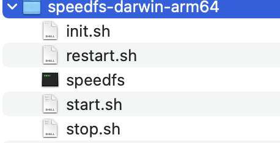
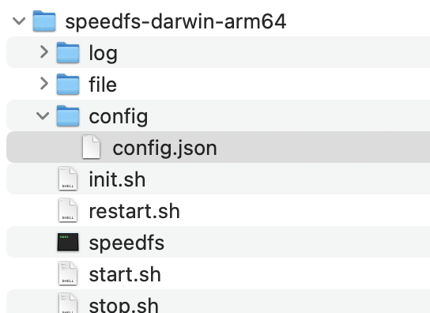

# speedfs

## 介绍
speedfs是一个轻量级高性能分布式文件存储系统。适合只需要一个高可用性能较好的分布式文件存储系统的2B或2G的小型项目。

主要特性：
* 去中心化高可用:集群的所有节点都是对等的，可同时读写
* 高性能:上传、下载、节点间通信采用http协议;节点之间异步同步
* 部署、运维方便:配置简单直观、部署运维脚本完备，开箱即用

## 核心设计
本项目深度参考了go-fastdfs(https://github.com/sjqzhang/go-fastdfs) 的实现。设计上做了一些精简，一致性方面做了一些优化。
* 文件路径命名设计
  * 文件命名：HHmmss_uuid_filename 解释：上传时时刻的时分秒_uuid_文件名 例：151802_b918c350b8cb4318acbcc0dafab369f6_你好世界.txt
  * 文件全路径：SPEEDFS_PATH/file/yyyyMMdd/HHmmss_uuid_filename 解释：speedfs的部署目录/file/上传时刻的年月日/文件名 例：/root/test/speedfs/file/20240103/160151_3f0db6c3d1bc4db1afaa34bb2456c95b_你好世界.png
  * 文件对外暴露路径：/yyyyMMdd/HHmmss_uuid_filename 应用使用此路径调接口下载文件

* 自动修复
每天凌晨3点每个节点会比较自己和其他节点的差异，每个节点只会同步自己没有的，别的节点有的。

## speedfs的数据一致性说明：
* 写文件
每次上传都会使用uuid生成唯一命名的文件名，即使两次上传同一份文件，对于speedfs来说也会分别保存，每次返回的路径也不一样。因此对写数据来说不存在并发冲突问题。文件上传到调用的节点成功后，会异步通知其他节点同步数据。
* 读文件
访问的节点有则返回，没有从其他节点依次尝试访问查询，如果则同步拉取到本地然后返回。
* 删文件
调用节点删除成功后，节点会异步通知其他节点删除。

从上面读写删的描述看，单纯的写和读不会有一致性问题，删除在极端情况下会有删除不干净的情况，比如在上传文件异步同步的期间突然调用了删除接口，可能存在删除不干净的情况。如果应用本身做了删除会不会再查看的操作那么即使出现删除不干净的情况也不会影响业务。

## 安装部署
安装包可通过release页面下载,也可以自行编译
### 获取安装包

### 自行编译
默认当前机器平台编译
```shell
#项目根目录执行
make pack
```
交叉编译命令
```shell
make pack target=linux-amd64
make pack target=linux-arm64
make pack target=darwin-amd64
make pack target=darwin-arm64
```

### 安装
* 解压压缩包



* 初始化

```shell
./init.sh
```
执行后会在当前目录生成file(存文件),log(存日志),config(存配置)等目录



```shell
.
├── log #日志
├── file #文件目录
├── config #配置
│   └── config.json #配置文件
├── init.sh 			#初始化脚本
├── restart.sh			#重启脚本
├── speedfs			    #speedfs二级制
├── start.sh			#启动脚本
└── stop.sh				#停止脚本
```
* 修改配置

配置文件为json格式config/config.json配置项说明
```shell
{
    "port": 9999, #http监听服务端口,默认9999,意寓服务经久不断
    "advertise-ip": "192.168.31.192", #内网ip,高可用集群中其他节点可以访问的ip,默认初始化为内网ip
    "peers": [ #集群地址列表,所有节点都配同样的列表,当前节点地址的ip部分需要和advertise-ip保持一致
        "192.168.31.192:9999"
    ]
}
```
配置样例:

假设在192.168.31.191,192.168.31.192两台机器部署高可用集群,那么配置为
```shell
#192.168.31.191配置
{
    "port": 9999, 
    "advertise-ip": "192.168.31.191", 
    "peers": [ 
        "192.168.31.191:9999","192.168.31.192:9999"
    ]
}
```
```shell
#192.168.31.192配置
{
    "port": 9999, 
    "advertise-ip": "192.168.31.192", 
    "peers": [ 
        "192.168.31.191:9999","192.168.31.192:9999"
    ]
}
```

* 启动
```shell
./start.sh
```
* 其他运维命令
```shell
./restart.sh #重启
./stop.sh    #停止服务
```
## 接口文档
### 上传接口
请求参数
- **方法：** `POST`
- **路径：** `/upload`
- **参数：**
  - `file` (表单参数)：要上传的文件
响应
```shell
{
  "status": "success", #成功:succss 失败:fail
  "code":0, #错误码,默认0,系统错误:1000
  "msg":""  #错误信息
  "data": {
    #文件路径
    "filepath":"/20240103/160151_3f0db6c3d1bc4db1afaa34bb2456c95b_xxx.png",
    #下载链接
    "downloadUrl":"http://192.16.31.192:9999/20240103/160151_3f0db6c3d1bc4db1afaa34bb2456c95b_xxx.png"
  }
}
```
应用端可选择存文件路径,好处是文件迁移到其他ip的机器也不影响,坏处是下载的时候需要拼接ip端口

### 下载接口
请求参数
- **方法：** `GET`
- **路径：** `/{filepath}`
- **参数：**
  - `filepath` (路径参数)：要下载文件的路径

响应
```shell
文件写入输出流
```
### 删除接口
请求参数
- **方法：** `POST`
- **路径：** `/delete`
- **参数：**
  - `filepath` (表单参数)：要删除的文件路径
    响应
```shell
{
  "status": "success", #成功:succss 失败:fail
  "code":0, #错误码,默认0,系统错误:1000
  "msg":""  #错误信息
  "data": null
}
```
## TODO
- [ ] 权限验证
- [ ] 客户端调用样例
- [ ] 单元测试
- [ ] docker
- [ ] 压测
- [ ] gc-tracker
